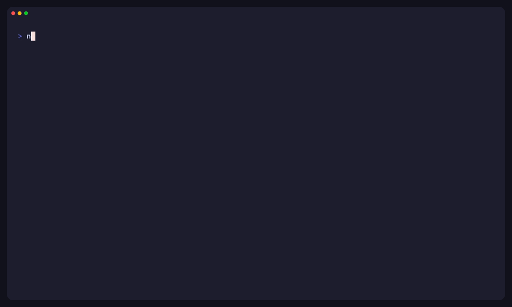

# AgentLoop Context Contract

AgentLoop Start Preflight turns local repo evidence into a compact, auditable briefing for software agents and reviewers.

Use `agentloop doctor --redact-paths` before the first agent session in a repo or after a harness upgrade. Doctor reports whether generated guidance tells agents to run Doctor before Start, use Start, list and expand context handles, avoid broad reads, and call `agentloop_start` through MCP when available. Use `agentloop start` when a session begins and the agent needs the shortest read-first briefing. Use `agentloop context` when the agent or reviewer needs the lower-level receipt, omission list, budget, and source-handle expansion.

```bash
agentloop doctor --redact-paths
agentloop start --for codex --goal implement --redact-paths
agentloop context budget
agentloop context handles --redact-paths
agentloop context pack --for codex --goal continue --redact-paths
agentloop context show <handle-from-start>
```



The demo shows the Start preflight loop: check agent-readiness guidance, run Start, expand a source handle only when the agent needs detail, then verify with local evidence.

For a repeatable messy-repo trial, run the [Start usefulness demo](start-usefulness-demo.md). It creates a temporary repo, checks the Doctor Agent Readiness Matrix, and shows the Start usefulness proof: agent readiness, context avoided, broad files avoided, stale proof, scope drift, source handles, and next command.

```text
Your software agent / app
  (Codex, Claude Code, Cursor, OpenCode, Gemini CLI, Copilot CLI,
   LangChain, Agno, Strands, your own scripts...)
        |
        | task contracts - diffs - verification - runs - research notes - logs
        v
 +------------------------------------------------------------------------+
 | AgentLoop Start Preflight + Context Contract (source truth stays here) |
 |------------------------------------------------------------------------|
 | State -> Next Safe Command -> Read First -> Risk -> Impact -> Handles   |
 |                                      |                                  |
 |                                      +-- task:active (current work only)|
 |                                      +-- verification:latest            |
 |                                      +-- run:latest                     |
 |                                      +-- evidence-map:current           |
 |                                      +-- context-budget:current         |
 |                                                                        |
 | Goals: implement - continue - review - debug - handoff - research       |
 | MCP tools - generated agent instructions - transparent local heuristics |
 +------------------------------------------------------------------------+
        |
        | compact preflight + retrieval handles
        v
Agent session / review / research handoff
```

## What It Solves

Software agents often waste context on broad file lists, stale chat history, old logs, and repeated repo explanation. AgentLoopKit can do better because it already knows the current task contract, changed-file evidence map, verification freshness, run ledger, and next action.

Start gives the agent:

- the current active or open task when one exists
- the current preflight state
- the next safe command
- the first source handles to read
- the risk and proof summary
- how much context pressure was avoided by using a compact pack
- which local handle expands the source truth

The lower-level context contract then explains what was included, what was omitted, why, and how to retrieve source truth.

Start and Context use a current-work rule. Archived, `done`, `deferred`, and AgentFlight placeholder tasks remain previous evidence. The next agent session gets task setup guidance instead of `task:active` handles or `agentloop ship` guidance from old work.

The savings number is a planning estimate. AgentLoopKit estimates tokens as `ceil(character_count / 4)`. Broad context is the newline-joined changed-file path list. Compact context is the compact evidence summary plus next actions. It does not claim provider-token counts, billable-token savings, or universal percentages.

## Commands

### Start

```bash
agentloop doctor --redact-paths
agentloop start --for codex --goal implement --redact-paths
agentloop start --for human --goal review --json
```

`start` is the canonical agent entry point. It returns a compact preflight with a decisive state such as `ready-to-continue`, `needs-task`, `needs-verification`, `scope-drift`, `review-ready`, `blocked-by-risk`, or `evidence-only`. It also shows the current task when one exists, next safe command, read-first handles, do-not-broad-scan guidance, risk summary, impact ledger, and source handles. Use `context handles` when an agent needs the current handle inventory outside Start. Use `context show <handle>` to expand source truth after reading the briefing. When only previous task evidence exists, Start reports `needs-task` instead of treating archived evidence as current work.

Start also includes a usefulness proof near the top of the briefing. It reports the preflight state, estimated context avoided, broad files avoided, stale proof, scope drift, verification freshness, available source handles, and next safe command. These values come from local evidence and transparent estimates, not provider billing data.

### Budget

```bash
agentloop context budget
agentloop context budget --json
agentloop context budget --redact-paths
```

`budget` estimates the size of broad changed-file context versus the compact pack surface. Estimates use a transparent character-count heuristic. They are planning guidance, not provider tokenizer output or billing claims.

JSON output keeps the evidence summary, coverage, risk, verification, next actions, claims, and a local expansion handle. It omits the full changed-file detail by default. Use `agentloop context show evidence-map:current` when an agent or reviewer needs the full local evidence map.

### Handles

```bash
agentloop context handles
agentloop context handles --json
agentloop context handles --redact-paths
```

`handles` lists the local source handles an agent can expand, whether each one is available, why it matters, and the exact `context show` command to use. Missing task, verification, or run evidence appears as unavailable handle rows instead of command errors.

### Pack

```bash
agentloop context pack --for codex --goal continue
agentloop context pack --for claude --goal review
agentloop context pack --for cursor --goal research
agentloop context pack --for generic --goal handoff --json
```

Supported targets are `codex`, `claude`, `cursor`, `generic`, and `human`.

Supported goals are `continue`, `review`, `debug`, `handoff`, and `research`.

The pack includes:

- active task summary
- reviewability
- evidence-map summary
- verification freshness
- next actions
- context budget
- receipt
- source handles
- safety boundary

The pack omits broad chat history, broad file contents, full logs, old runs, and provider traffic by default. It explains each omission and gives local retrieval commands where relevant.

JSON and MCP pack payloads also omit the full `evidenceMap.files` array. They keep compact evidence fields and include `evidence-map:current` as the source handle for full local detail.

### Show

```bash
agentloop context show task:active
agentloop context show verification:latest
agentloop context show run:latest
agentloop context show evidence-map:current
agentloop context show context-budget:current
```

`show` expands a local source handle. Agents should read the compact pack first, then expand only the source handles they need.

## Research Work

Use `--goal research` when the task is local product, customer, usability, or technical research:

```bash
agentloop create-task --type research --title "Understand checkout drop-off"
agentloop context pack --for generic --goal research --redact-paths
```

AgentLoopKit can structure research work, record evidence boundaries, and help agents continue from local notes. It does not recruit participants, run interviews, analyze private datasets automatically, call external services, or turn simulated persona notes into real user evidence.

## Safety Boundary

Context commands are read-only. They do not run verification, read `.env` contents, call an LLM, intercept prompts, proxy provider traffic, post comments, publish packages, create tags, upload files, or mutate task state.

Use `--redact-paths` before sharing output in public logs. Context paths are repo-relative by default, and redaction keeps local roots out of shareable output.
